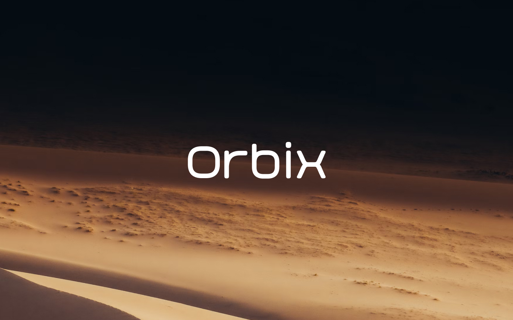
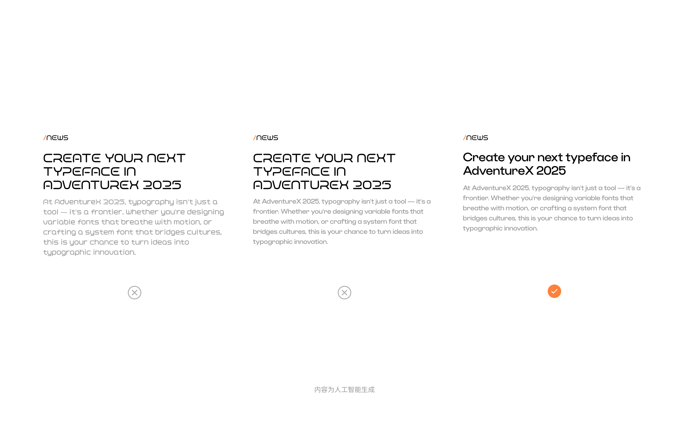
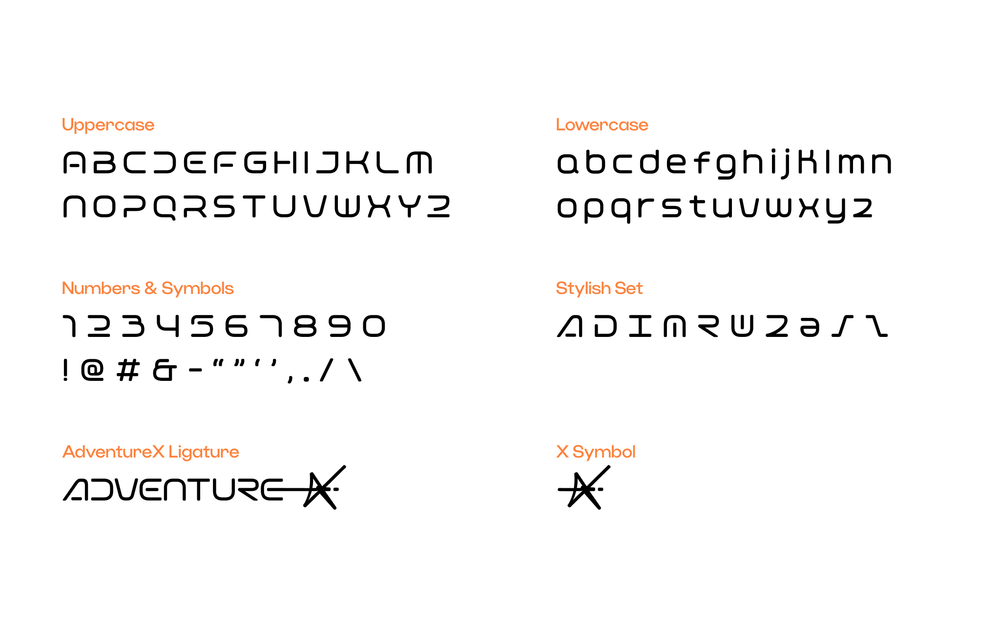
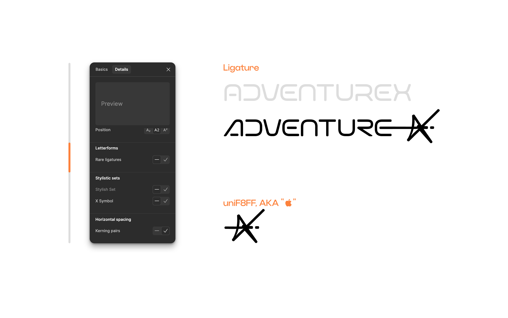

[[简体中文]](README-CN.md)　[[English]](README.md)

# Orbix

Orbix 是一款由 Besign Foundry 铸字坊设计的曲线圆润的风格开源字体，为 AdventureX 打造。AdventureX 品牌标识亦基于此诞生。如果你打算在涉及 AdventureX 相关排版中应用此字体执行创意，我们建议你阅读这份字体介绍。

# 使用场景

Orbix 是一款风格字体，在比例较为接近方形的同时，圆润的曲线设计进一步降低了 Orbix 在长文本中的可读性。
因此，相较于标题与正文，Orbix 更适用于短词语或是五个单词以下的场景中作为标注元素使用，并且在大多数情况下，考虑到可识别性，我们建议你在此类文本中使用全大写且使用比较醒目的颜色。
一般来说，我们不建议你在标题与正文中使用 Orbix。

# 字符

Orbix 字体目前仅支持大小写字母、数字和基础符号，包含风格变体共 87 个字符：

# 风格变体

Orbix 字体支持风格变体并提供 2 个变体集合。
以 Figma 为例，你可以在支持 OpenType 特性的设计工具中启用这些特性。
风格变体如下：

# 品牌合字与特殊字符

介于最初设计 Orbix 的目的是为 AdventureX 打造一款风格字体，且 AdventureX 的品牌标识亦基于此。Orbix 支持将 "ADVENTUREX" 替换为 AdventureX 品牌标识。在风格变体中启用 ss02 - X Symbol 后，文本内的 "X" 均会被替换为 "X" 符号。
以 Figma 为例，你可以在支持 OpenType 特性的设计工具中启用这些特性。
除在风格变体和合字中启用特性之外，Orbix 支持将 uniF8FF，也就是 "" 字符替换为 "X" 符号，如果你使用的是 Apple 设备，只需按下 ⌥ option + ⇧ shift + K 即可直接键入该字符。

最后祝使用愉快。
