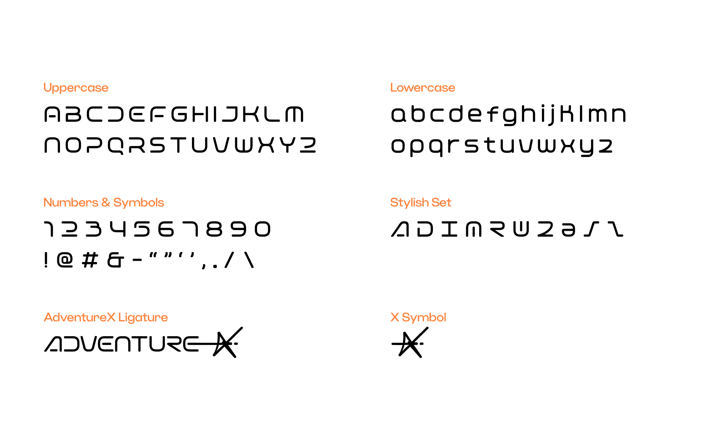

[[简体中文]](README-CN.md)　[[English]](README.md)

# Orbix

Orbix is an open-source style font with rounded curves designed by Besign Foundry, created for AdventureX. The AdventureX brand logo was also born on this basis. If you plan to apply this font to execute ideas in AdventureX-related typesetting, we recommend that you read this font introduction.

# Scenario

Orbix is a style font. While the proportion is close to square, the rounded curve design further reduces the readability of Orbix in long text.

Therefore, compared with the title and body, Orbix is more suitable for use as a notation element in short words or scenarios with less than five words, and in most cases, considering the recognizability, we recommend that you use all capitalization and more eye-catching colors in such texts.

Generally speaking, we do not recommend that you use Orbix in the title and text.

# Characters

Orbix fonts currently only support uppercase and lowercase letters, numbers and basic symbols, containing a total of 87 characters of style variants:

# Stylish Sets

Orbix font supports stylish set and provides 2 collections.

Take Figma as an example, you can enable these features in design tools that support OpenType features.

The stylish sets are showing as follows:

# Brand ligature and special characters

The original purpose of Orbix was to create a style font for AdventureX, and AdventureX's brand logo was also based on this. Orbix supports replacing "ADVENTUREX" with the AdventureX brand logo. After enabling ss02 - X Symbol in the style variant, the "X" in the text will be replaced by the "X" symbol.

Take Figma as an example, you can enable these features in design tools that support OpenType features.

In addition to enabling features in style variants and characters, Orbix supports replacing uniF8FF, that is, the "" character with the "X" symbol. If you are using an Apple device, just press ⌥ option + ⇧ shift + K You can type the character directly.

Finally, wish you had a pleasant journey: )
